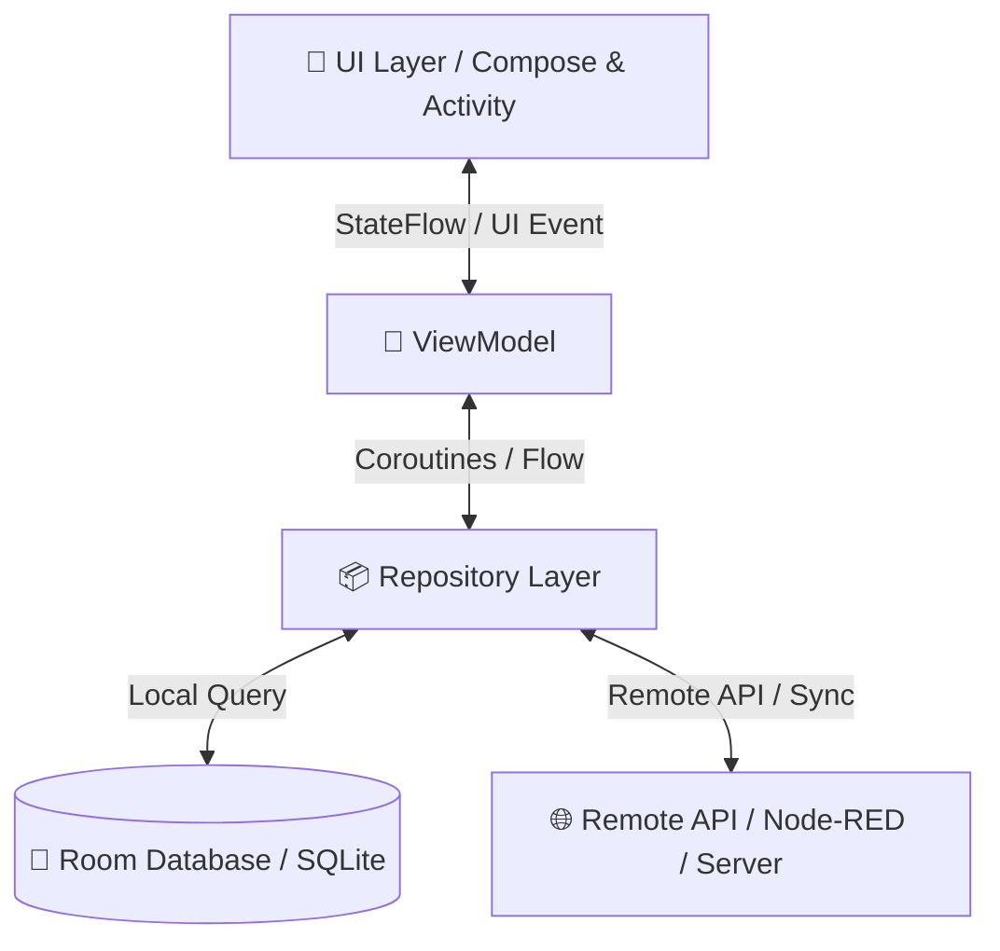
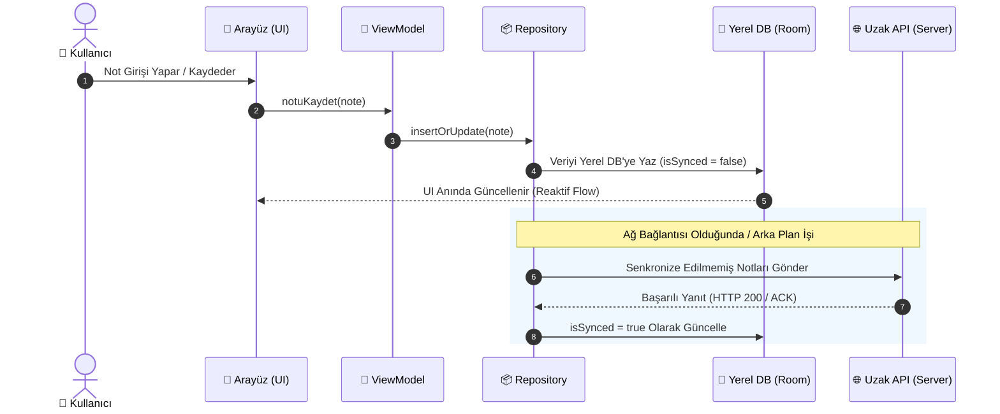

<div align="center">

# 📱 PersonelNoteKotlin

**Kotlin ile geliştirilmiş, çevrimdışı öncelikli (offline-first) ve reaktif veri akışına sahip modern mobil not yönetim uygulaması.**

[](https://github.com/UmutGuvenUslu/PersonelNoteKotlin/actions)
[](LICENSE)
[](https://kotlinlang.org/)
[](CONTRIBUTING.md)
[](https://github.com/UmutGuvenUslu/PersonelNoteKotlin/stargazers)

<p align="center">
  <a href="#-neden-personelnotekotlin">Neden PersonelNoteKotlin?</a> •
  <a href="#-mimari-ve-veri-akışı">Mimari</a> •
  <a href="#-çevrimdışı-offline-first-senkronizasyon-akışı">Offline Senkronizasyon</a> •
  <a href="#-temel-özellikler">Özellikler</a> •
  <a href="#-kurulum-ve-çalıştırma">Kurulum</a> •
  <a href="#-proje-dizin-yapısı">Dizin Yapısı</a>
</p>

</div>

---

## 🎯 Neden PersonelNoteKotlin?

> **Problem:** Günümüzün mobil dünyasında sürekli internet bağlantısına bağımlı olmak, veri kaybına ve yavaş kullanıcı deneyimine yol açar. Basit not uygulamaları zayıf veri bütünlüğü sunarken, kurumsal araçlar ise sade bir not alma deneyimi için gereksiz karmaşıklık barındırır.

**Çözüm:** **PersonelNoteKotlin**, modern Android ve Kotlin mimari standartlarına uygun, çevrimdışı çalışabilen (**Offline-First**) ve verileri reaktif olarak yöneten yüksek performanslı bir mobil çözümdür.

---

## 🧠 Mimari ve Veri Akışı

Uygulama, **Clean Architecture** ve **MVVM (Model-View-ViewModel)** prensiplerine göre yapılandırılmıştır:



---

## 🔄 Çevrimdışı (Offline-First) Senkronizasyon Akışı

Not oluşturma, düzenleme ve senkronizasyon adımlarının işleyişi:



---

## ✨ Temel Özellikler

* 📝 **Hızlı ve Kesintisiz Not Alma:** Sıfır gecikme ile anında yerel veritabanına kayıt.
* 📶 **Offline-First Desteği:** İnternet bağlantısı olmasa bile tüm notlara tam erişim ve düzenleme imkanı.
* ⚡ **Reaktif Veri Akışı:** Kotlin Coroutines ve `StateFlow` / `SharedFlow` ile gerçek zamanlı UI güncellemeleri.
* 🛡️ **Tip Güvenliği ve Sağlamlık:** Kotlin'in modern null-safety ve güçlü tip mekanizması.
* 🧱 **Temiz ve Modüler Kod Mimarisi:** Katmanlı mimari (Data, Domain, Presentation) ile yüksek test edilebilirlik.

---

## 🛠️ Teknik Mimari & Bağımlılıklar

| Bileşen | Teknoloji / Kütüphane | Kullanım Amacı |
| :--- | :--- | :--- |
| **Dil** | Kotlin | Güvenli, modern ve yüksek performanslı uygulama mantığı |
| **Derleme Aracı** | Gradle (Kotlin DSL - `.kts`) | Tip güvenli ve modüler bağımlılık yönetimi |
| **Asenkron Yapı** | Kotlin Coroutines & Flow | Asenkron iş parçacığı yönetimi ve reaktif akışlar |
| **Yerel Depolama** | Room Database / SQLite | SQLite tabanlı güvenli yerel veri saklama |
| **Mimari Standart** | MVVM / Clean Architecture | Katmanlar arası ayrım ve sürdürülebilir kod yapısı |

---

## 📂 Proje Dizin Yapısı

```plaintext
PersonelNoteKotlin/
├── 📁 .gradle/               # Gradle önbellek ve daemon yapıları
├── 📁 .idea/                 # IDE yapılandırma dosyaları
├── 📁 app/                   # Ana uygulama modülü
│   └── 📁 src/
│       ├── 📁 main/
│       │   ├── 📁 java/com/personelnote/
│       │   │   ├── 📁 data/          # Room DB, Entity ve Repository implementasyonları
│       │   │   ├── 📁 domain/        # Use Case'ler ve veri modelleri
│       │   │   └── 📁 presentation/  # UI bileşenleri, Screen'ler ve ViewModel'lar
│       │   └── 📄 AndroidManifest.xml
│       └── 📁 test/                  # Birim (Unit) testleri
├── 📁 gradle/wrapper/        # Gradle Wrapper dosyaları
├── 📄 .gitignore             # Git izleme dışı dosyalar
├── 📄 build.gradle.kts       # Kök proje Gradle yapılandırması
├── 📄 gradle.properties      # JVM ve derleme optimizasyon parametreleri
├── 📄 gradlew / gradlew.bat  # Gradle wrapper başlatma betikleri
├── 📄 settings.gradle.kts    # Modül tanımlamaları
└── 📄 README.md
```

---

## 🚀 Kurulum ve Çalıştırma

### Gereksinimler

* **Java Development Kit (JDK):** Sürüm 17 veya üzeri
* **Android Studio / IntelliJ IDEA:** Güncel sürüm
* **Git**

---

### Kurulum Adımları

1. **Repoyu Klonlayın:**
   ```bash
   git clone [https://github.com/UmutGuvenUslu/PersonelNoteKotlin.git](https://github.com/UmutGuvenUslu/PersonelNoteKotlin.git)
   cd PersonelNoteKotlin
   ```

2. **Projeyi Derleyin:**
   ```bash
   # Linux & macOS
   ./gradlew build

   # Windows
   gradlew.bat build
   ```

3. **Birim Testlerini Çalıştırın:**
   ```bash
   # Linux & macOS
   ./gradlew test

   # Windows
   gradlew.bat test
   ```

---

## 🤝 Katkıda Bulunma

1. Projeyi Fork'layın (`Fork`)
2. Yeni bir özellik dalı açın (`git checkout -b feature/YeniOzellik`)
3. Değişikliklerinizi commit edin (`git commit -m 'feat: Yeni özellik eklendi'`)
4. Dalınıza push yapın (`git push origin feature/YeniOzellik`)
5. Bir **Pull Request** açın

---

<div align="center">

Geliştirici: **[Umut Güven Uslu](https://github.com/UmutGuvenUslu)**

⭐ Projeyi beğendiyseniz yıldız vermeyi unutmayın!

</div>
